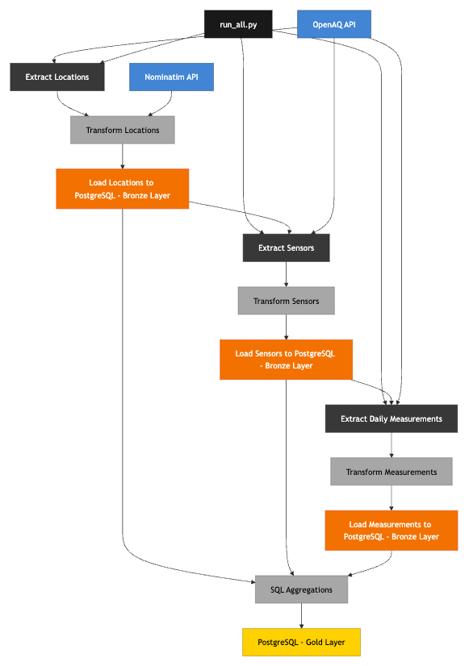

# OpenAQ ETL Pipeline

A Python ETL pipeline that extracts air quality data from the [OpenAQ API](https://api.openaq.org/v3), enriches it with reverse geocoding via [Nominatim](https://nominatim.openstreetmap.org), and loads it into a PostgreSQL database. The pipeline is containerised with Docker and deployed as a scheduled ECS task on AWS.

## Pipeline Stages

The pipeline runs in three sequential bronze stages, followed by a gold layer transformation:

1. **Locations** — fetches monitoring station metadata for a given country and enriches each location with city/state via reverse geocoding
2. **Sensors** — fetches sensor details for every location stored in the database
3. **Measurements** — fetches daily PM2.5 readings for each sensor over a rolling 6-month window
4. **Gold layer** — runs Jinja-templated SQL transformations over the bronze data for staging and analysis

## Architecture Diagram



## Project File Structure

```
etl/
├── assets/
│   ├── extract_locations_bronze.py
│   ├── extract_sensors_bronze.py
│   └── extract_daily_measurements_bronze.py
├── connectors/
│   ├── openaq_client.py
│   └── nominatim_client.py
├── db/
│   └── postgresql_client.py
├── pipelines/
│   ├── openaq_locations.py
│   ├── openaq_sensors.py
│   ├── openaq_daily_measurements.py
│   ├── run_all.py
│   └── gold_load.py
├── config/
│   ├── config.py
│   └── bronze_tables.yaml
└── sql/
    ├── staging/
    └── analysis/
```

## Infrastructure

- **Docker** — the pipeline runs as a single container defined in `Dockerfile`
- **Amazon ECR** — container images are stored and versioned in ECR
- **Amazon ECS** — the pipeline runs as task on ECS, triggered on a schedule via EventBridge
- **PostgreSQL** — bronze and gold data are stored in RDS PostgreSQL
